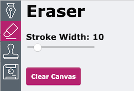
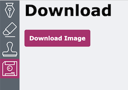
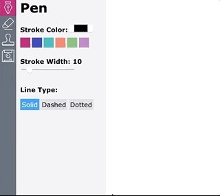

# Social Tables Apprentice Challenge

Thanks for your interest in the Social Tables Apprentice Program!

[Social Tables](https://www.socialtables.com/) engineering is looking for apprentices! The position is a great opportunity to learn and grow on a fantastic team working with fun, exciting technologies. Many of our excellent engineering staff were once apprentices.

Your task, should you choose to accept it, is to build out some features for a React drawing app! Women, LGBTQ+ and people of color are especially encouraged to apply!

- **Submissions are due by 11:59pm on Sunday, July 28th.**

For applicants who successfully complete this code challenge, there will be a phone screen and potential on-site interview. Our goal is for apprentices to begin onboarding in early September. There is some flexibility on start date to accommodate your schedule.

## Getting Started
1. Clone the `starter` branch of this repo
2. Open the folder and run:
    - `nvm use && npm i`
    - `npm start`
    - and in another terminal: `npm run server` (you may not need this if you don't choose to do the back-end optional features)
3. Open the app and take a look around!
4. Once you've taken a look at the starter code and app, you'll notice that clicking on the eraser icon in the NavBar doesn't do anything! You should expect see the `<Eraser />` component rendered in the `<ToolPanel />`. This is a great place to start before moving on to adding the required features below!

## Required Features
Please refer to the below specs to add/update the following features:
### Pen Panel

- [ ] **style** to match the designs above
- [ ] add a **color picker** to control stroke color (the built-in HTML color picker works great here)
- [ ] add the ability to change **line type** between `solid`, `dashed`, and `dotted` (see gif below)

### Eraser Panel

- [ ] When the eraser panel is selected, the brush should **erase** what you've drawn (Hint: there is a particular color that makes for a great eraser.)
- [ ] Create a **reset button** that clears the canvas

### Stamp Panel

- [ ] Make a **stamp tool** that lets users upload an image and stamp it onto the canvas
- [ ] Add a **max-width slider** for stamped images

### Download Panel

- [ ] Add a **Download Image** button that lets users download their artwork

## Tests
- [ ] Write 3 tests using cypress to test functionality of the tool panel. 2 examples are provided. To run tests, run the command `npm run test`. You can open the cypress UI by running `npm run cypress:open`.

## Optional Features (Pick 2!)
Please pick 2 of the following optional features to add to the drawing app:
- [ ] Save app state to localstorage so that it persists on reload
- [ ] Add color swatches to the Pen Panel that let you select one of the previous 6 colors picked with the color picker
- [ ] Stamp panel: save each of the uploaded images to state so users can click on a previously uploaded image to stamp
    
- [ ] Add a route to the included server that sends the array of images in `data/images.js` and load them as default stamp options
- [ ] Download panel: on opening the download panel, save a snapshot of the current canvas. When a user clicks on a snapshot, load that image onto the canvas

	
- [ ] Download Panel: share image link
  - [ ] Build a route that posts your glorious drawing to the s3 bucket called `socialtables-apprenticeship`
  - [ ] In your app, build a button that uses this route to save your drawing to s3 and get a shareable link that opens in a new window

	

## Helpful Resources
- [MDN Canvas Tutorial](https://developer.mozilla.org/en-US/docs/Web/API/Canvas_API/Tutorial)
- [Official React Docs](https://reactjs.org/docs/getting-started.html)
- [Official React Hooks Overview](https://reactjs.org/docs/hooks-overview.html)
- [A Complete Guide to useEffect](https://overreacted.io/a-complete-guide-to-useeffect/): a great explanation of one of the trickier aspects of hooks

## How to submit
Upload all files to a cloud provider of your choice (Dropbox, google Drive, etc.) and send your link(s) to [apprenticeshipchallenge@socialtables.com](mailto:apprenticeshipchallenge@socialtables.com) with the subject line: `Social Tables Apprentice Challenge`.

Please include:
* `YourInitials-readme.{md, txt}` containing:
    * Instructions for running your code
    * Any notes you wish to include
    * **Brief answers to the following questions**:
        1. What aspect of your submission are you most proud of, and why?
        1. What would you work on if you had more time?  
        1. Of all the resources (blog posts, tutorials, videos, mentors etc.) you referenced, what was most helpful for you?
* `YourInitials-code.{tar.gz, zip}` with your code.
    * Submitting your `node-modules` folder isn't necessary, because we can get it by running `npm install`
    * You should submit any files you found necessary to change and enough support and explanation so we can reproduce your results. In any case, include all the information in `YourInitials-readme.{md, txt}`.
* `YourInitials-resume.pdf` containing your resume.

## FAQ
* **Do I need to complete the entire challenge to submit? I'm not sure if my submission is good enough**
	No, we are happy to look at any submissions, seriously! You have nothing to lose by submitting -- just document where you ended up in your README.md.

* **What resources should I use?**
	You are encouraged to use any resources you can find on the internet. A list of suggested references is included below.

* **Do I need React experience to apply?**
	No! Many of our engineers had not worked with React prior to starting at Social Tables.

* **Does it benefit me to submit my application early?**
	No. While we highly encourage you to submit before the deadline (end of day Sunday, July 28), all applications will all be evaluated after that point, not on a rolling basis.

* **Can I post my solution to the Internet/GitHub?**
	We ask that you don't. It makes it much harder to evaluate submissions when a completed solution is available for review.

* **Does that mean I should not fork this repo and push my changes or solution to my fork or any other public GitHub page?**  
	Yes.

* **Can I copy someone else's submission, cite it, and submit?**
	No.

* **I see a typo.**
	Submit a pull request!

* **Do I need to support IE8? WebTV? Mosaic?**
	No. We will evaluate submissions in Google Chrome.

* **I still have a question.**
	Submit a Github issue.