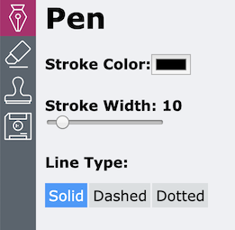
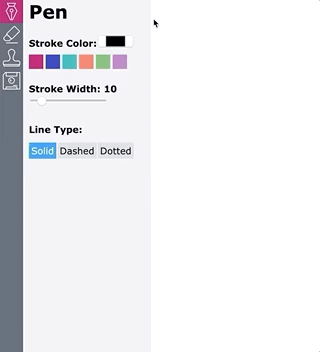

# Social Tables Apprentice Challenge

Thanks for your interest in the Social Tables Apprentice Program!

[Social Tables](https://www.socialtables.com/) Engineering is looking for apprentices! The position is a great opportunity to learn and grow on a fantastic team working with fun, exciting technologies. Many of our excellent engineering staff were once apprentices.

Our Apprenticeship program is geared towards new developers without professional coding experience and provides the tools and guidance to get ramped up to working in a production environment. The Apprentice Program will be a 12 week (~40 hour/week) paid contract position here at ST HQ in Washington, with the potential for a full time offer to join our Engineering team.  We are looking for hard-working folks who love to learn and are hungry to improve their abilities. You will be paired with a team of fantastic engineers working on a specific product or objective, and get an opportunity to hone your skills in a collaborative setting. Social Tables is committed to fostering a sense of community, supporting each other, and growing together.

Your task, should you choose to accept it, is to build out some features for a React drawing app! Women, non-binary, LGBTQ+, and people of color are especially encouraged to apply!

- **Submissions are due by 11:59pm on Sunday, July 28th.**

For applicants who successfully complete this code challenge, there will be a phone screen and potential on-site interview. Our goal is for apprentices to begin on-boarding in early September. There is some flexibility on start date to accommodate your schedule.

## What We are Looking For
- Did you read this README and follow all instructions?
- Did you demonstrate attention to detail?
- Is your code well-organized and readable?
- What choices did you make?
  - Code comments and your own README will help us understand your thought process and allow us to get to know you better as a candidate

## Getting Started
Note: You'll need a version of [`Node.js`](https://nodejs.org/en/) (>= v8) set up on your machine to run the code.
1. Clone the `master` branch of this repo
2. Open the folder and run:
    - `npm i`
    - `npm start`
    - and in another terminal: `npm run server` (you may not need this if you don't choose to do the back-end optional features)
3. Open the app and take a look around!
4. Once you've taken a look at the starter code and app, you'll notice that clicking on the eraser icon in the NavBar doesn't do anything. You should expect see the `<Eraser />` component rendered in the `<ToolPanel />`. This is a great place to start before moving on to adding the required features below.

## Required Features
Please refer to the below specs to add/update the following features:
### Pen Panel

- [ ] **style** to match the designs above
- [ ] add a **color picker** to control stroke color
  - the built-in HTML color picker works great here
  - the native color picker can look quite different across browsers/OSs. Do not worry about styling it to match exactly with the above image.
- [ ] add the ability to change **line type** between `solid`, `dashed`, and `dotted` (see gif below)

### Eraser Panel

- [ ] When the eraser panel is selected, the brush should **erase** what you've drawn (Hint: there is a particular color that makes for a great eraser.)
- [ ] Use a **brush size slider** for the eraser
- [ ] Create a **reset button** that clears the canvas

### Stamp Panel

- [ ] Make a **stamp tool** that lets users upload an image and stamp it onto the canvas
- [ ] Add a **max-width slider** for stamped images

### Download Panel

- [ ] Add a **Download Image** button that lets users download their artwork

### Tests
[Cypress](https://www.cypress.io/) is a modern and relatively easy to use testing tool. Here at Social Tables we are making a big testing push this year and beyond.
- [ ] Write 3 tests using [Cypress](https://www.cypress.io/) to test functionality of the tool panel (required)
  - 2 examples are provided (see `/cypress/integration/test_spec.js`)
  - To run your tests, run the command `npm run test`
  - You can open the cypress UI by running `npm run cypress:open`

### Optional Features (Pick 2!)
Please pick 2 of the following optional features to add to the drawing app:
- [ ] Save app state (i.e. active tool and tool settings) to localstorage so that it persists on reload
- [ ] Add color swatches to the Pen Panel that let you select one of the previous 6 colors picked with the color picker
- [ ] Stamp panel: save each uploaded image to state so users can click on a previously uploaded image to stamp
    - 
- [ ] Add a route to the included server that sends the images in `public/images` and loads them as default stamp options
- [ ] Download panel: on opening the download panel, save a snapshot of the current canvas. When a user clicks on a snapshot, load that image onto the canvas

	

- [ ] ~~Download Panel: share image link~~
  - [ ] ~~Build a route that posts your glorious drawing to the s3 bucket called `socialtables-apprenticeship`~~
  - [ ] ~~In your app, build a button that uses this route to save your drawing to s3 and get a shareable link that opens in a new window~~
  
_due to confusion, we've removed this bonus option. sorry!_ 

## Helpful Resources
- [MDN Canvas Tutorial](https://developer.mozilla.org/en-US/docs/Web/API/Canvas_API/Tutorial)
- [Official React Docs](https://reactjs.org/docs/getting-started.html)
- [Official React Hooks Overview](https://reactjs.org/docs/hooks-overview.html)
- [A Complete Guide to useEffect](https://overreacted.io/a-complete-guide-to-useeffect/): a great explanation of one of the trickier aspects of hooks
- [Cypress Testing Docs](https://docs.cypress.io/guides/overview/why-cypress.html)

## How to Submit Your Challenge
1. Add `YourInitials-readme.{md, txt}` to the top level of your project folder containing:
   - Instructions for running your code
   - Any notes you wish to include
   - **Brief answers to the following questions**:
     1. What aspect of your submission are you most proud of, and why?
     2. What would you work on if you had more time?
     3. Of all the resources (blog posts, tutorials, videos, mentors etc.) you referenced, what was most helpful for you?
2. Delete your `node_modules` folder (we can get them back by running `npm i`) and zip up your project as `YourInitials-code.{zip, tar.gz}`
   - You should submit any files and enough support and explanation so we can reproduce your results. In any case, include all this information in `YourInitials-readme.{md, txt}`.
3. **Fill out the application on the [Social Tables Job Board](https://jobs.lever.co/socialtables/2a2eb002-1def-4eae-a617-21388f1eb84d).**

## FAQ
* **Do I need to complete the entire challenge to submit? I'm not sure if my submission is good enough**
  - No, we are happy to look at any submissions--seriously! You have nothing to lose by submitting. Just document where you ended up in your README
* **What resources should I use?**
  - You are encouraged to use any resources you can find on the Internet. A list of suggested references is included above.
- **Can I install additional Node modules?**
  - It is possible to complete all features using native Javascript and React without adding additional packages. That said, if there's something you'd _really really_ like to use, be sure to document it in your README so we can understand your reasoning.
* **Do I need React experience to apply?**
  - No! Many of our engineers had not worked with React prior to starting at Social Tables.
* **Does it benefit me to submit my application early?**
  - No. While we highly encourage you to submit before the deadline (end of day Sunday, July 28), all applications will be evaluated after that date, not on a rolling basis.
* **Can I post my solution to the Internet/GitHub?**
  - We ask that you don't. It makes it much harder to evaluate submissions when a completed solution is available for review.
* **Does that mean I should not fork this repo and push my changes or solution to my fork or any other public GitHub page?**
  - Yes, exactly.
* **Can I copy someone else's submission, cite it, and submit?**
  - No.
* **I see a typo.**
  - Submit a pull request!
* **Do I need to support IE8? WebTV? Mosaic?**
  - No. We will evaluate submissions in Google Chrome.
* **I still have a question.**
  - Submit a Github issue, or send us an email at apprenticeshipchallenge@socialtables.com
